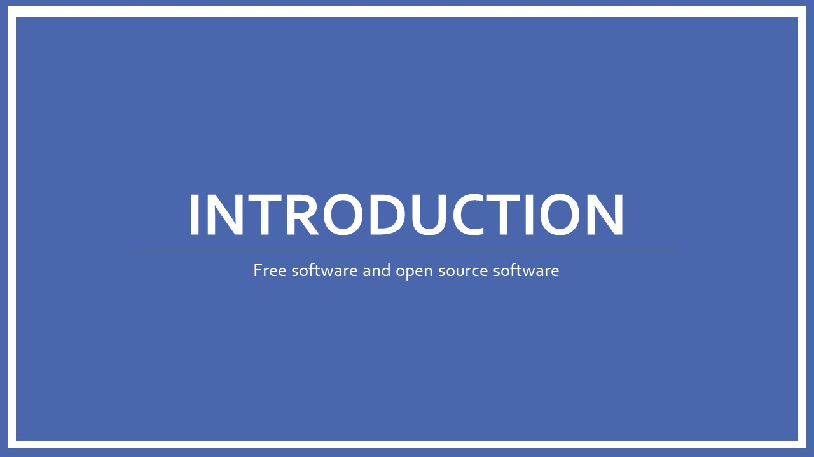

# Introduction

Free software means that the users have the freedom to run, edit, contribute to, and share the software. Thus, free software is a matter of liberty, not price. We have been defending the rights of all software users for the past 35 years. Help sustain us for many more
